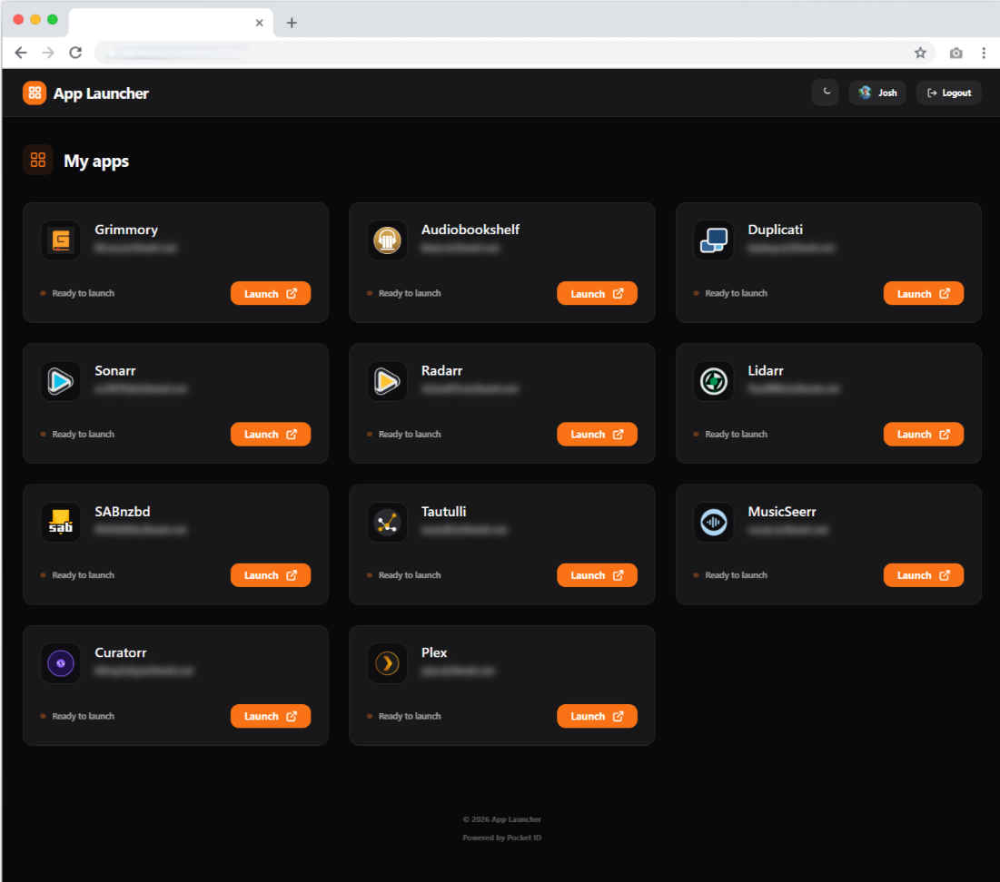

# Pocket ID App Launcher

A clean, simple, and aesthetically pleasing application launcher designed for families and friends. It integrates directly with your self-hosted **Pocket ID** instance to fetch applications and handle authentication.



## Features
- **OIDC Authentication:** Secured by your own Pocket ID instance.
- **Dynamic App List:** Automatically fetches applications you have access to via the Pocket ID API.
- **Light & Dark Mode:** Matches the official Pocket ID Zinc-style themes with a manual toggle.
- **Clean UI:** Responsive grid that automatically adjusts based on screen width.
- **Customizable:** Change titles and descriptions via environment variables.
- **Unraid Optimized:** Structured JSON logging designed for RAM-based log protection and persistent file storage.

---

## 🚀 Setup Instructions

### 1. Pocket ID Configuration

Before deploying the launcher, you need to configure two things in your Pocket ID administration panel:

#### A. Create an OIDC Client
1. Go to **Administration** > **OIDC Clients** > **Add Client**.
2. **Name:** `App Launcher` (or whatever you prefer).
3. **Callback URLs:** `https://launcher.yourdomain.com/callback` (Replace with your actual URL).
4. **Client ID & Secret:** Note these down; you'll need them for the environment variables.

#### B. Generate an API Key
1. Go to **Administration** > **API Tokens**.
2. Create a new token with at least `read` access to clients.
3. Note this token down.

### 2. Environment Variables

| Variable | Requirement | Description | Example |
| :--- | :--- | :--- | :--- |
| `POCKET_ID_URL` | **Required** | The URL of your Pocket ID instance | `https://auth.example.com` |
| `POCKET_ID_API_KEY` | **Required** | The API Token from step 1B | `pid_xxxx...` |
| `OIDC_CLIENT_ID` | **Required** | Client ID from step 1A | `...` |
| `OIDC_CLIENT_SECRET` | **Required** | Client Secret from step 1A | `...` |
| `AUTH_SECRET` | **Required** | Secret for signing session cookies | `(Run: openssl rand -hex 32)` |
| `PUBLIC_APP_URL` | **Required** | The public URL of this launcher | `https://launcher.example.com` |
| `PUBLIC_LAUNCHER_TITLE` | Optional | Custom title shown in header | `Family Apps` |
| `PUBLIC_LAUNCHER_DESCRIPTION` | Optional | Custom welcome message | `Access our services below` |
| `CUSTOM_LOGO_DARK` | Optional | Logo for dark theme (URL or local path) | `/app/logo-dark.png` |
| `CUSTOM_LOGO_LIGHT` | Optional | Logo for light theme (URL or local path) | `/app/logo-light.png` |
| `UPTIME_KUMA_URL` | Optional | Public URL of your Uptime Kuma instance | `status.example.com` |
| `UPTIME_KUMA_SLUG` | Optional | The 'Slug' from Status Page settings | `default` |
| `LOG_LEVEL` | Optional | Logging verbosity (debug, info, warn, error) | `info` |
| `LOG_PATH` | Optional | Path for persistent JSON log file | `/app/logs/launcher.log` |

---

## 🐳 Docker Deployment

### Unraid Installation
1. Go to the **Docker** tab in Unraid.
2. Click **Add Container**.
3. **Name:** `pocket-id-launcher`
4. **Repository:** `ghcr.io/kc9wwh/app-launcher:latest`
5. **Network Type:** `Bridge`.
6. **Port 3000:** Map to your desired host port.
7. **Volume Mapping (Optional for persistence):**
    - **Container Path:** `/app/logs/`
    - **Host Path:** `/mnt/user/appdata/app-launcher/`
    - **Access Mode:** Read/Write
8. **Environment Variables:** Add the variables listed above. 

### Docker Compose
```yaml
services:
  app-launcher:
    image: ghcr.io/kc9wwh/app-launcher:latest
    container_name: app-launcher
    ports:
      - "3000:3000"
    environment:
      - POCKET_ID_URL=https://auth.example.com
      - POCKET_ID_API_KEY=pid_xxxx...
      - OIDC_CLIENT_ID=...
      - OIDC_CLIENT_SECRET=...
      - AUTH_SECRET=...
      - PUBLIC_APP_URL=https://launcher.example.com
      - CUSTOM_LOGO_DARK=/app/logo-dark.png # Optional: Theme specific logos
      - CUSTOM_LOGO_LIGHT=/app/logo-light.png
    volumes:
      - /path/to/logs:/app/logs
      - /path/to/logo-dark.png:/app/logo-dark.png:ro
      - /path/to/logo-light.png:/app/logo-light.png:ro
    restart: unless-stopped
```

### Cloudflare Tunnel
If using a Cloudflare Tunnel:
1. Point your public hostname (e.g., `launcher.example.com`) to the local IP and port of this container (e.g., `http://192.168.1.10:3000`).
2. Ensure your `PUBLIC_APP_URL` matches the Cloudflare hostname exactly.

### 3. Global Health Header (Optional)
To enable the health status pill in the header, integrate it with an Uptime Kuma Status Page.

#### Finding your Slug
1. Log in to your **Uptime Kuma** instance.
2. Navigate to **Status Pages** in the top menu.
3. Select your desired status page and click **Edit**.
4. The **Slug** is found in the 'Slug' field (e.g., `default` or `main`). This corresponds to the URL path: `your-kuma-url.com/status/slug`.

#### Security & Cloudflare Tunnels
If your Uptime Kuma instance is behind a Cloudflare Tunnel, the launcher requires client-side access to the Heartbeat API.
- **CORS Configuration**: You must handle CORS if the launcher and Uptime Kuma are on different domains. In Cloudflare, create a **Response Header Transform Rule** to add `Access-Control-Allow-Origin` for your launcher's domain.
- **WebSocket Enablement**: While the status pill uses the JSON Heartbeat API, ensure WebSockets are enabled in your Cloudflare Tunnel settings if you plan to use other Uptime Kuma features that depend on them.

---

## 🛠️ Local Development

```bash
# Install dependencies
npm install

# Run in development mode
npm run dev
```

## 📝 License
MIT
